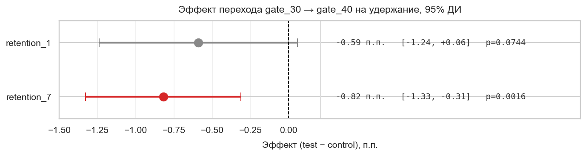

# A/B-тест Cookie Cats

Разбор реального A/B-теста мобильной игры Cookie Cats. В контроле первый «гейт» стоит на 30 уровне, в тесте — на 40. Вопрос: вырастет ли удержание, если отодвинуть гейт.

Данные: 90 189 игроков, [Kaggle](https://www.kaggle.com/datasets/yufengsui/mobile-games-ab-testing).

## Результат

| Метрика | gate_30 | gate_40 | p-value | Вывод |
|---|---|---|---|---|
| retention_1 (день 1) | 44.8% | 44.2% | 0.074 | не значимо |
| **retention_7 (день 7)** | **19.0%** | **18.2%** | **0.0016** | **тест хуже** |
| sum_gamerounds (медиана) | 17 | 16 | 0.05 (MWU) | на грани |

Перенос гейта на 40 уровень снижает 7-дневное удержание. Раскатывать не нужно.



## Что в ноутбуке

- SRM-проверка — рандомизация не сломана.
- A/A-тест (1000 сплитов контроля) — процедура калибрована, FPR ≈ 5%.
- Z-тест пропорций для retention_1 и retention_7 с 95% ДИ.
- Bootstrap (5000 итераций) — независимая проверка устойчивости.
- Mann–Whitney для sum_gamerounds + sensitivity без выбросов.
- Bayes (Beta-Binomial): P(test > control) для retention_7 ≈ 0.08%.
- Сегментный анализ: эффект сидит в сегменте, дошедшем до зоны гейта.
- Bonferroni на 3 теста — главный эффект всё ещё значим.
- Pre-experiment design: расчёт размера выборки под MDE 0.5 п.п. и power-кривая.

## Почему перенос гейта ухудшил retention_7

Гипотеза: ранний гейт работает как «возврат». Игрок упирается, откладывает телефон, возвращается завтра. Если гейт отодвинуть — игрок не упирается, но и не возвращается. Сегментный анализ это подтверждает: у тех, кто не дошёл до 30 раундов, разницы нет; у тех, кто дошёл — эффект отрицательный и значимый.

## Запуск

```bash
pip install -r requirements.txt
jupyter notebook ab_test_cookie_cats.ipynb
```

Ноутбук уже исполнен, GitHub откроет его прямо в браузере.

## Стек

pandas, numpy, scipy.stats, statsmodels, matplotlib, seaborn.
